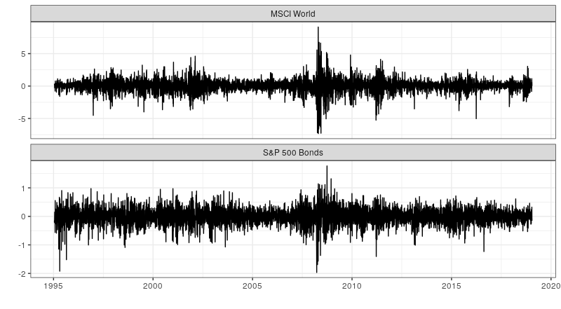

BEKKs
=====

Modelling conditional volatilities and correlations among multivariate time series in R

## Overview

The package 'BEKKs' contains functions and methods for a careful analysis, estimation and forecasting of financial asset returns dynamics, and the construction and evaluation of financial portfolios. Modelling correlations and covarainces is important to determine portfolios with focus on hedging and asset specialization strategies, as well as to forecast value-at-risk (VaR) thresholds. 

The cornerstone functions to estimate correlation and covaraince processes are

-   `bekk()` the BEKK(1,1) model by Engle and Kroner (1995).

## Installation

```r
install.packages("BEKKs")
```

Alternatively, install the development version


```r
install.packages("devtools")
devtools::install_github("alexanderlange53/BEKKs")
```


```r
library("BEKKs")
```

## Usage

To get started, use the example data set which is included in the package. The data set consists of two daily financial time series, i.e. S&P 500 bond returns and MSCI World returns. More details on the data set are provided in the description file `?StocksBonds`.

```r
library("ggplot2")
library("ggfortify")
autoplot(StocksBonds  , facet = TRUE) + theme_bw()
```



We estimate the conditional variance and covariance processes via the BEKK(1,1) model

```r
m1 <- bekk(StocksBonds)
summary(m1)

# BEKK estiamtion results
# -----------------------
# Log-likelihood: -7407.91
# BEKK model stationary: TRUE
# Number of BHHH iterations: 50
# Estimated paramater matrices: 
# 
# C 
#            [,1]         [,2]
# [1,] 0.02781423 0.0006233005
# [2,] 0.00000000 0.1181025776
# 
# A 
#              [,1]       [,2]
# [1,]  0.186828249 0.02482309
# [2,] -0.009778605 0.28638092
# 
# G 
#             [,1]          [,2]
# [1,] 0.976841591 -0.0007262051
# [2,] 0.001180173  0.9493469743
# 
# t-values of paramater matrices: 
# 
# C 
#          [,1]        [,2]
# [1,] 11.35226  0.04609706
# [2,]  0.00000 19.02970255
# 
# A 
#          [,1]       [,2]
# [1,] 26.25035  0.9269617
# [2,] -4.01463 37.3502093
# 
# G 
#            [,1]         [,2]
# [1,] 497.842578  -0.08394647
# [2,]   1.539511 343.88192299
```

The summary includes general information on the estimation (see `?bekk`), the estimated parameter matrices C, A and G and the corresponding t-values.
