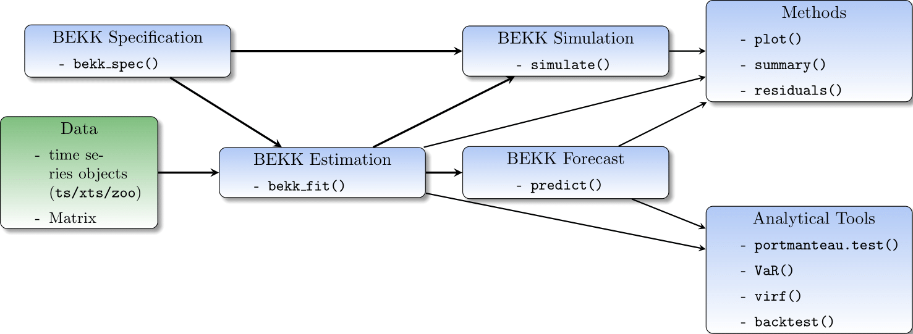
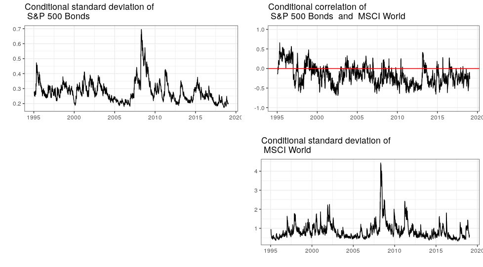
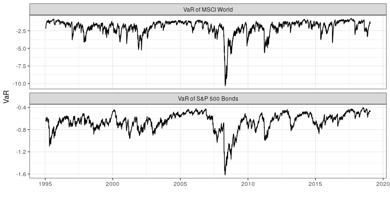
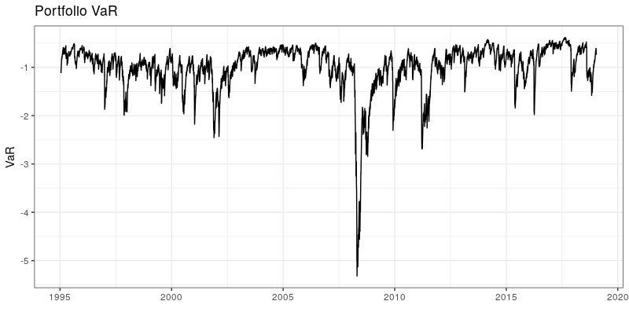
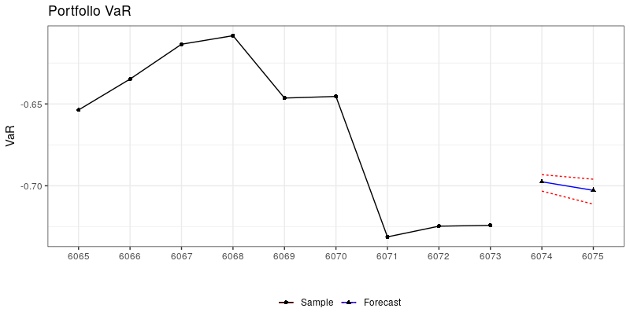

BEKKs
=====

Modelling conditional volatilities and correlations among multivariate time series in R

## Overview

The package 'BEKKs' contains functions and methods for a careful analysis, estimation and forecasting of financial asset returns dynamics, and the construction and evaluation of financial portfolios. Modelling correlations and covariances is important to determine portfolios with focus on hedging and asset specialization strategies, as well as to forecast value-at-risk (VaR) thresholds. 

Below find a schematic overview of the package functions and methods.

 

The main function of the package is `bekk_spec()` which determines the behavior of the subsequent methods with the most important specifications:

```r
bekk_spec(
  model = list(
    type = "bekk", 
    asymmetric = FALSE
    )
)
```

The model type by default is a symmetric BEKK(1,1) according to Engle and Kroner (1995). Alternative specifications are (forthcoming) the diagonal BEKK (`type = "dbekk"`) and scalar BEKK (`type = "sbekk"`). All types can be specified as either symmetrical or asymmetrical models.     

## Installation

```r
install.packages("BEKKs")
```

Alternatively, install the development version


```r
install.packages("devtools")
devtools::install_github("alexanderlange53/BEKKs")
```


```r
library("BEKKs")
```

## Usage

To get started, use the example data set which is included in the package. The data set consists of two daily financial time series, i.e. S&P 500 bond returns and MSCI World returns. More details on the data set are provided in the description file `?StocksBonds`.

```r
library("ggplot2")
library("ggfortify")
autoplot(StocksBonds  , facet = TRUE) + theme_bw()
```


We estimate the conditional deviations and correlation processes via the symmetric BEKK(1,1) model

```r
s1 <- bekk_spec()
m1 <- bekk_fit(s1,  StocksBonds)
summary(m1)

# BEKK estimation results
# -----------------------
# Log-likelihood: -7382.256
# BEKK model stationary: TRUE
# Number of BHHH iterations: 15
# Estimated paramater matrices: 
# 
# C 
#            [,1]        [,2]
# [1,] 0.01978368 -0.01496272
# [2,] 0.00000000  0.08526574
# 
# A 
#              [,1]        [,2]
# [1,]  0.178859630 -0.03715201
# [2,] -0.007691659  0.29814734
# 
# G 
#             [,1]       [,2]
# [1,] 0.981184605 0.01326038
# [2,] 0.001337367 0.95143161
# 
# t-values of paramater matrices: 
# 
# C 
#          [,1]     [,2]
# [1,] 8.979949  1.21244
# [2,] 0.000000 13.41001
# 
# A 
#          [,1]      [,2]
# [1,] 29.17318  1.640942
# [2,]  3.55672 42.056807
# 
# G 
#            [,1]       [,2]
# [1,] 693.873974   2.099117
# [2,]   2.154099 409.769546
```

The summary includes general information on the estimation (see `?bekk_fit`), the estimated parameter matrices C, A and G and the corresponding t-values. The estimated volatility and covariance processes can be shown with `plot(m1)`.



The estimated conditional covariances can be used for risk management purposes, for example, to calculate VaR at the 99% level in accordance with Basel regulations.

```r
v1 <- VaR(m1)
plot(v1)
```



Alternatively, we can calculate the 99% VaR of a typical portfolio consisting of 30% bonds and 70% stocks:

```r
portfolio_weights <- c(0.3, 0.7)
v2 <- VaR(m1, portfolio_weights = portfolio_weights)
plot(v2)
```


To predict the future VaR of the 30/70 portfolio, for example for the next two days, we can use the function `bekk_forceast` and calculate the VaR again.

```r
f1 <- bekk_forecast(m1, n.ahead = 2)

v3 <- VaR(f1, portfolio_weights = portfolio_weights)
plot(v3)
```

